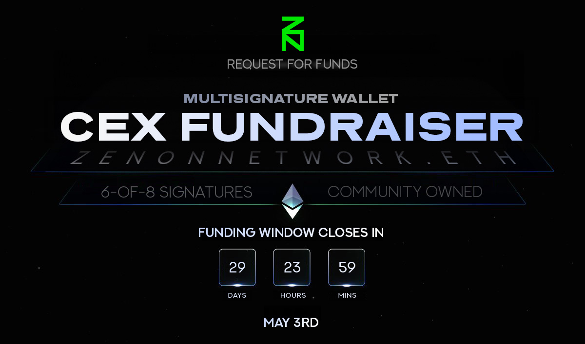

# CEX Fundraiser - Open until May 3rd, 2024

This document provides all the necessary details about the CEX fundraising event organized by the Zenon Network community, including a short bio about participating members in the multisignature wallet, and how you can contribute.

For more information, refer to the original [discussion](https://forum.zenon.org/t/cex-fundraiser-open-until-may-3rd-2024).

## Fundraiser Details
- Objective: Raise funds for a CEX listing.
- Target goal: **$80K USDT**
- Recommended currencies: $USDT / $USDC, $ETH, $WBTC, $wZNN, $ZNN

## How to Contribute
:warning: ETHEREUM NETWORK ONLY :warning:  
 
Please, send donations to the following Ethereum address or ENS name. 
 
Zenon Network Fundraising Multisignature Address: 
`0xA06Ded756B823fCe92d5Da890aEd1C2d6677F2B3`

 

Alternatively, you can use the following ENS (Ethereum Name Service) domain name on compatible wallets: 
`zenonnetwork.eth`

---

⚠️ NETWORK OF MOMENTUM ONLY ⚠️ 
 

Due to popular demand, [SultanOfStaking has enabled his SOS Community Address to receive native ZNN donations](https://twitter.com/sultanofstaking/status/1778099355821478357?s=61&t=Q30TfKSdOpq7z9EKyk_Dbg) for the duration of the event.  

Please send donations to the following NoM address: 

SOS Community Address:  
`z1qrcc2c65w4d3zested2wl00hfyhr7022h92l92`

 

## CEX Multisig Signers - 6 out of 8 signatures required - *powered by [Safe](safe.global)*

### [Shaimo](https://twitter.com/shaimo) `@shaimo`
An og amongst ogs. Participated in xStakes, the original inception of Zenon.

### [SultanOfStaking](https://twitter.com/SultanOfStaking) `@SultanOfStaking`
Brand to one of the most delegated pillars historically. Creator of #FreeZenonFriday.

### [sumamu](https://twitter.com/su_mamu_) `@su_mamu_`
Nominated for HyperCore. Part of the Multichain team that developed the EVM bridge. Rockstar dev.

### [DeeZNNutz](https://twitter.com/0x3639) `@0x3639`
One of the most engaged members of the Zenon community, contributing on multiple fronts and currently serving as the lead maintainer of the zenon-network GitHub repository.

### [coinselor](https://twitter.com/coinselor) `@coinselor`
Arquitect behind ATSocy, a publication about NoM. Author of "The REAL Zenon Enigma", an article trying to create a holistic view of NoM's BTC interoperability. Maintainer of Zenon Social channels.

### [Stark](https://twitter.com/Stark_of_Zenon) `@Stark_of_Zenon`
Outspoken alien and creator of "Zenon Core", an ordinals collection that highlights the Zenon gensis. Owner of Stark Pillar. Maintainer of Zenon Social channels.

### [Zashu](https://twitter.com/zashounet) `@zashounet`
A well-known alien with deep knowledge of and curiosity about Zenon's mysterious origins. Maintainer of Zenon Social channels.

### [Sugoi](https://twitter.com/sugoibtc) `@sugoibtc`
Longstanding member of Zenon's first awareness initiative (ZIF). Owner of the Outlawz Pillar. Maintainer of Zenon Social channels.

## How to Track Donation Amounts
To monitor the donations, please refer to the following wallet addresses in a blockchain explorer:
- [Zenon Network Fundraising Address (ETH)](https://etherscan.io/address/0xA06Ded756B823fCe92d5Da890aEd1C2d6677F2B3)
- [SOS Community Address (NoM)](https://zenonhub.io/explorer/account/z1qrcc2c65w4d3zested2wl00hfyhr7022h92l92)

